# Plugin QGis Assistant odonyme

## Version 1.4.0 &nbsp;&nbsp;&nbsp;&nbsp;&nbsp;&nbsp; IGN - DTSO 

 
	 

| Version | Date  | Modifié par | Commentaire |
|--|--|--|--|
| 0.1 |  | Gérôme PECHEUR | Création du manuel utilisateur  |
| 0.3 | 11/2024 | Gérôme PECHEUR | Adaptation à la version 0.3 du plugin |
| 1.0.0 | 07/07/2025 | Gérôme PECHEUR | Première version diffusée |
| 1.1.0 | 25/07/2025 | Philippe GALLEN | Adaptation à la version 1.1.0 du plugin |  
| 1.2.0 | 07/01/2026 | Philippe GALLEN | Adaptation à la version 1.2.0 du plugin |  
| 1.4.0 | 11/03/2026 | Philippe GALLEN | Adaptation à la version 1.4.0 du plugin |  

  <h2 style="color: #00ADC5">Sommaire</h2>

- [1. Prérequis](#1-prérequis)
- [2. Résumé](#2-résumé)
- [3. Installation](#3-installation)
- [4. Présentation](#4-présentation)
- [5. Mode de sélection](#5-mode-de-sélection)
  - [5.1 Sélection unique](#51-sélection-unique)
  - [5.2 Sélection multiple](#52-sélection-multiple)
  - [5.3 Affichage du sens de numérisation et des INSEE](#53-affichage-du-sens-de-numérisation-et-des-insee)
- [6. Modifications](#6-modifications)
- [7. Renommage](#7-renommage)
- [8. A propos de](#8-a-propos-de)
- [9. Annexes](#9-annexes)
  - [9.1 Installation d'openpyxl](#91-installation-dopenpyxl)  

  

  <h2 id="1-prérequis" style="color: #00ADC5" >1. Prérequis</h2>

Version de QGIS 3 : 3.28 ou supérieure.  
Ce plugin fonctionne en parallèle du plugin « IGN Espace collaboratif » version 4.2.2 et IGN_Maitre.  
Ce plugin est utilisable sur la couche éditable Tronçon_de_route de la BDTopo.  
Le fonctionnement de certaines fonctionnalités nécessite l’installation des plugins IGN 
(IGN)chemin-le-plus-court-qgis-plugin (version minimum 1.1.0)

Si le package « openpyxl » n’est pas installé sur le poste, le message d’erreur ci-dessous apparaît lors d’une transaction.  

 
	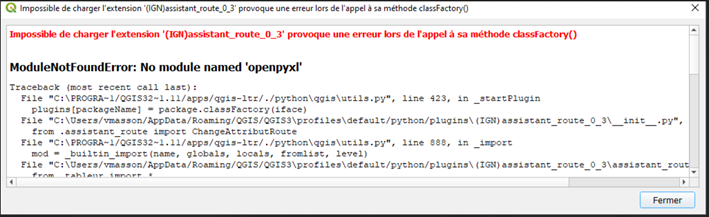 

Voir la procédure en annexe à la fin de ce document.  

  <h2 id="2-résumé" style="color: #00ADC5">2. Résumé</h2>

  
  
Ce plugin est une aide à la saisie des odonymes portés par les tronçons de route de la BDTopo.
L’interface permet de :  
-	Saisir ou **modifier** les odonymes (Noms collaboratifs gauche et droite) d’un ou plusieurs tronçons.  
-	Saisir ou **modifier** les alias gauche et droite d’un ou plusieurs tronçons.  
-	**Visualiser** les Nom BAN (gauche et droite)  
-	De sélectionner tous les tronçons entre 2 tronçons sélectionnés.  
-	De sélectionner tous les tronçons de même odonyme d’une commune sélectionnée.  
-	**D’afficher** le sens de numérisation des tronçons de route BDTopo.  
  
  

  <h2 id="3-installation" style="color: #00ADC5">3. Installation</h2>  

  
  
Ouvrir QGIS.  
Allez dans **Extensions/Installer/Gérer les extensions**, cliquez sur **Installer depuis un ZIP**, sélectionner le fichier ZIP puis cliquez sur **Installer le plugin**.  

 
	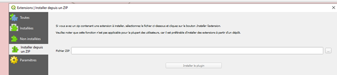 

  
  

  <h2 id="4-présentation" style="color: #00ADC5">4. Présentation</h2>

  
  

 
	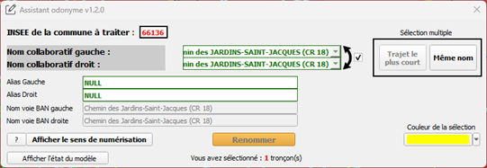 

  

Le bouton  permet d’afficher l’historique des versions et d’ouvrir la documentation du plugin.  
Le bouton 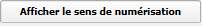 affiche ou masque le sens de numérisation des tronçons de route.
(Nécessite l’installation du plugin IGN Sens de numérisation)  

Le bouton 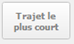 permet de sélectionner tous les tronçons de la commune compris entre 2 tronçons sélectionnés.
(Nécessite l’installation du plugin IGN Chemin le plus court)  

Le bouton 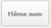 permet de sélectionner tous les tronçons de la commune de même nom collaboratif (gauche OU droite).  
Le bouton 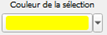 permet de modifier la couleur des tronçons sélectionnés dans QGIS. Ça peut être utile suivant la symbologie appliquées pour les tronçons dans QGIS.  

Le bouton  valide les modifications faites dans la couche du projet. Pour répercuter les modifications dans la BDUni il faut sauvegarder avec le plugin Espace Collaboratif IGN.  

La case à cocher  permet de modifier ou non simultanément le côté droit et gauche du tronçon sélectionné.  

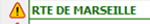 le point d’exclamation signifie que les tronçons sélectionnés n’ont pas tous le même nom collaboratif (dérouler la liste pour contrôler)  

Le code insee de la commune limite les actions aux seuls tronçons de la commune indiquée (chemin le plus court, même nom …)  

 
	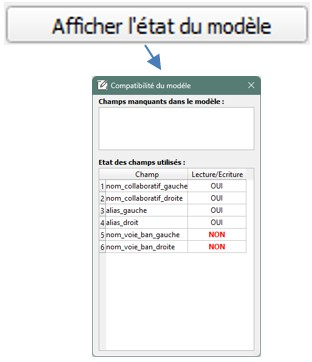 

A l’ouverture de l’outil, il y a une vérification de la présence dans le projet des couches nécessaires.  
Afficher l’état du modèle permet de vérifier les permissions sur chaque attribut.  
Ces permissions sont définies dans le projet en fonction des guichets en saisie directe dans la BDTOPO.  
  

  <h2 id="5-mode-de-sélection" style="color: #00ADC5">5. Mode de sélection</h2>

### 5.1 Sélection unique
-	On ne sélectionne qu’un seul tronçon avec l’outil de sélection de QGIS  

### 5.2 Sélection multiple
- Sélection multiple de tronçons portant le même nom collaboratif gauche OU droit, on sélectionne un tronçon, on clique sur le bouton  le résultat est une sélection de tous les tronçons portant le même nom collaboratif gauche OU droit et inclus dans la commune dont le code insee est affiché dans l’interface.  
 
-	Sélection multiple avec l’outil de saisie. Dans QGIS on peut sélectionner manuellement un ensemble de tronçons  

-	Sélection multiple de tronçons contigües : on sélectionne 2 tronçons (le premier tronçon du début de rue et le dernier tronçon de la fin de rue), <mark>Ces 2 tronçons doivent être visibles à l’écran et être connectés</mark>. Ensuite on clique sur « trajet le plus court ». Le résultat est une sélection de tous les tronçons entre le premier et le deuxième sélectionnés respectant l’algorithme du chemin le plus court. Un contrôle visuel est toutefois nécessaire afin de vérifier si les tronçons sont bien ceux désirés. <mark>La sélection regroupe uniquement les tronçons contenus dans la commune choisie.</mark>  
 
### 5.3 Affichage du sens de numérisation et des INSEE
-	Accessible via   
Ce bouton permet d’afficher sur les tronçons les sens de numérisations, les codes INSEE et les odonymes.  
Utile lorsque l’on travaille en limite de commune afin de savoir quel nom collaboratif correspond à celui de la commune choisie avant de le modifier.  
 

 
	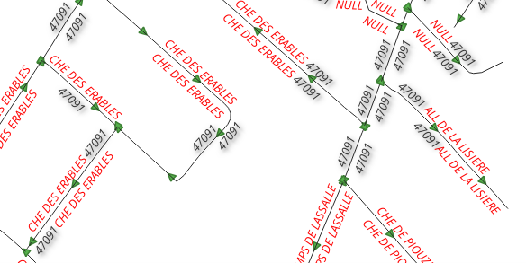 

  

 
	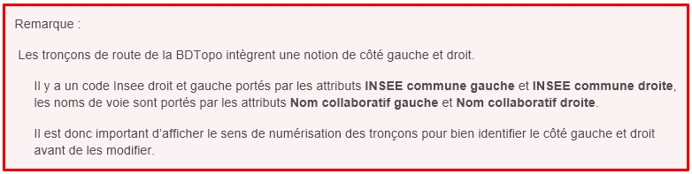 

  

  

  <h2 id="6-modifications" style="color: #00ADC5">6. Modifications</h2>

  
Une fois la sélection faite, il suffit de renseigner un nouveau nom collaboratif gauche et/ou droit.
Le (ou les) nom collaboratif à modifier apparaît en bleu.  

 
	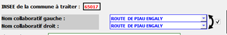 

Si on désire modifier simultanément les 2 noms collaboratifs, il faut activer le « verrou »   sinon les 2 champs seront indépendants.  
**Ne pas les lier est utile en limite de commune.**  

Si les tronçons sélectionnés n’ont pas le même nom collaboratif (gauche ou droit) un panneau point d’exclamation le signale. Il faut dérouler la liste des noms et sélectionner celui choisi.  

 
	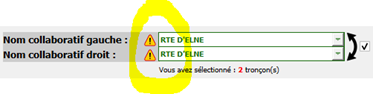 

  <h2 id="7-renommage" style="color: #00ADC5">7. Renommage</h2>

Pour valider les modifications faites dans l’outil il faut cliquer sur 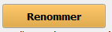  
Un message QGIS confirme la prise en compte des modifications.  

  

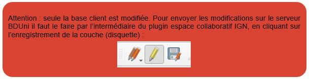  

-	<mark>IMPORTANT</mark> : il faut impérativement être connecté à l’espace collaboratif via le plugin Espace collaboratif  

Avant l’utilisation du plugin ou juste après une validation, lorsque QGIS demande de vous connecter si ce n’est pas déjà fait. Sinon les modifications seront effectives dans QGIS ET non dans l’espace collaboratif.  

-	Ne pas oublier de renseigner l’INSEE de la commune à traiter.  
SI le cadre « INSEE de la commune à traiter » est vide, il suffit soit de sélectionner un premier tronçon pour le remplir, soit de le remplir manuellement.  
Une fois l’INSEE renseigné, on ne peut que le modifier manuellement.  

-	Si on essaye de modifier un nom collaboratif droite ou gauche d’un tronçon en dehors de la commune choisie, la modification et la contribution directe ne se feront pas.  
On aura alors ce message :  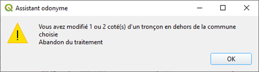 

  <h2 id="8-a-propos-de" style="color: #00ADC5">8. A propos de</h2>

Accessible via .  

 
	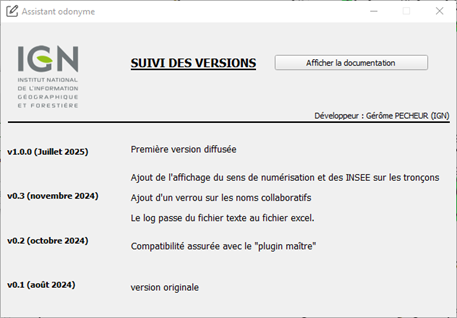 

  

Cette boîte permet de suivre l’évolution des différentes versions ainsi que d’afficher cette documentation.  

  <h2 id="9-annexes" style="color: #00ADC5">9. Annexes</h2>

### 9.1 Installation d'openpyxl

Ouvrir l’invite de commande, se placer dans le répertoire « bin » de l’installation de QGIS :  
Exemple :  

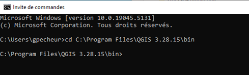  

Puis taper la commande : python-qgis-ltr.bat -m pip install openpyxl  

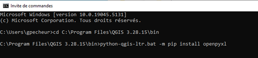  

Le package s’installe, vous n’avez plus qu’à relancer QGIS.  